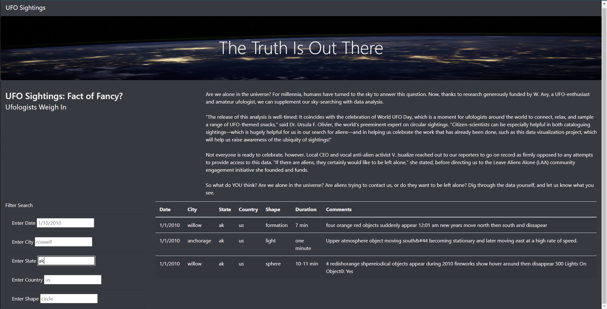

# UFOs

## Overview of Project :

The project aims to create a webpage with dynamic table with filters so that the users can analyze in-depth information of the UFO sightings such as date, city, state, country, and shape. 

## Results:

- Link to the webpage : https://amyyoon08.github.io/UFOs/  

- These examples show how to put single input in each section. However, users can put multiple input altogether.  

- Find Date :

- Find City :

- Find State :

- Find Country :

- Find Shape :

## Summary :

- The drawback is that they don't have the dropdown function,it's hard to find which items are listed in the table.

- Recommendation 1: create a dropdown function so that the users do not need to check up the table before they enter into the input section.

- Recommendation 2: because some results might be a lot and the table is long, so that they can put the navigation button to help custom going back to the top of the back without scrolling up. 
